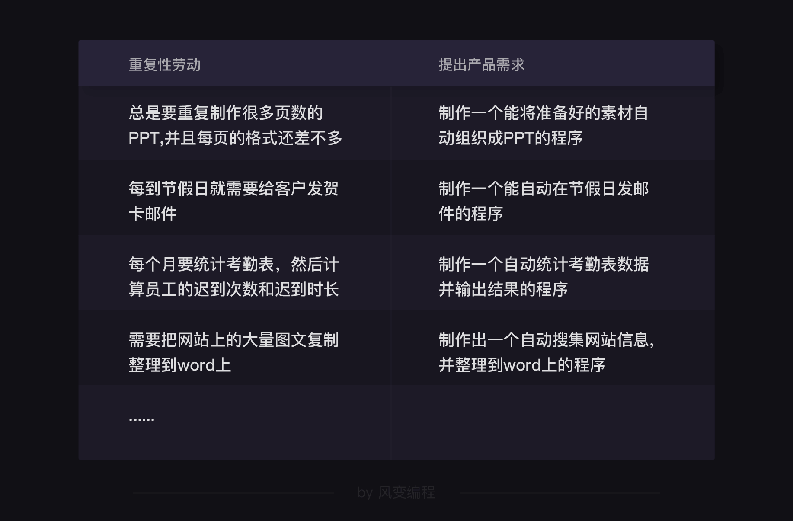
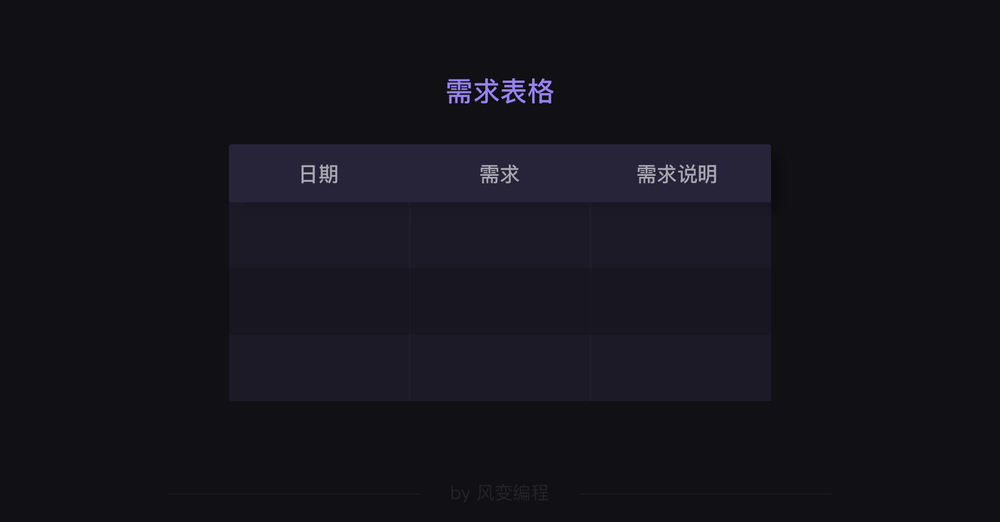
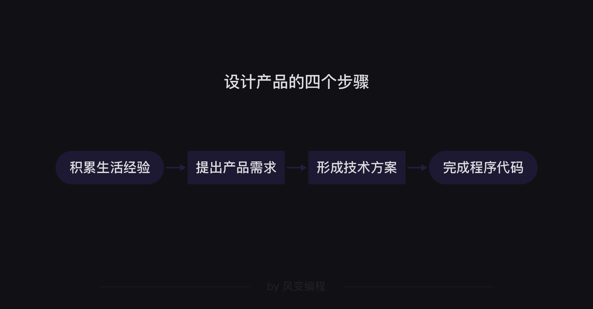

> ##  编程思维,产品思维

在上一关，我们实操了“发邮件”的小项目。当你掌握了“自学模块”的能力，你就相当于找到了一把钥匙，一把通往更广阔的技术世界的钥匙。

这一关，也是我们的最后一节思维课，我会向大家讲述如何利用编程知识去解决实际生活的问题，即掌握这把钥匙的使用方法。

我曾反复提到，我们学习编程的目的从来不是为了考试，而是要学会用编程能力帮自己解决实际问题。


但我们发现如果只是学习基础知识的话，还是不能解决实际问题。这就好比我们在学校学习了很多公式定理，但却发现它们在生活并没有什么用处。


其中一个原因是因为生活经验和所学知识之间存在脱节，导致知识无法运用到生活中。

编程技能也是如此：


对于编程来说，其实我们每个人都有足够的生活经验，在过去的一段时间里也掌握了基础知识，那么中间缺的究竟是什么呢？

我认为，这道连接编程知识和解决实际问题的桥梁就是“产品思维”。

这里我所说的【产品】，并非百货商场货架上的“产品”，而是“为自己或他人服务的程序”。说到这一点，我想跟你分享两个学员案例。

有位学员是大学老师，每次备课都要准备PPT。有时候一份PPT需要两三百页，并且重复的格式特别多。学完了“模块调用”后，他当时问我，有没有啥模块，可以帮他自动制作幻灯片。

我给他推荐了“`Presentation`”模块，并告诉他可以用这个模块创建PPT、按预想的格式填充PPT每页内容。

没想到的是，过了几天，他就跟我说，这个模块他已经自学学会了，还做了一个可以自动制作PPT的程序。只要先准备好素材，双击运行程序，就会自动生成PPT，类似这样：


有了这个程序，过去他每周需要花两天时间制作的PPT，现在只需要用2小时整理素材，后续工作全都可以交给程序完成。

像这类“为自己服务的程序”，就是合格的【产品】。

还有一位学员是名高三学生。做完项目后，他不满足于课程里的小游戏，受好奇心的驱使，自己也写了一个小游戏。大概长这样：


这个程序是个文字冒险游戏，可以提供给朋友们玩耍。游戏剧情会根据用户的选择来变化，甚至还有游戏记录存档的功能。

icon
像这类“为他人服务的程序”，也是合格的【产品】。

icon
于是我在想该如何把这种“DIY产品”的意识教给更多人呢？这就是这一关的核心知识，我希望你上完今天的课程，再加上一些探索和尝试，也能制作出自己的【产品】！

icon
课程内容主要分两大块，首先我会介绍一个思维工具——流程图，掌握了这一工具之后，我们再来聊聊产品设计的几大步骤。

> ### 流程图

工欲善其事必先利其器，我们首先要学习的是“流程图”，如果不先掌握“流程图”这个分析与思考的工具，就很难实践“产品设计”的相关方法。

相信大家之前一定也接触过流程图，我们可以把流程图理解成“用一种图示描述事物进行的过程”。比如我们去注册使用共享单车的过程，可以画出这样的流程图：


掌握了流程图后，你既可以用它分析思考问题，也可以用它搭建产品框架，还能用它设计代码逻辑。

所有的流程图，总结起来有三种类型：


是不是和我们之前学的条件判断和循环语句，有异曲同工之妙？

接下来让我们一个个来看。

- 顺序结构

当一件事情是按顺序进行的时候，我们就用顺序结构。一般会用到三种图形：


有些我们习以为常的行为，也可以拆解成一定的步骤。比如当我们在淘宝剁手的时候，粗糙的流程图是长这样的：


现在请你来思考一下，对于“煮饭”这件事，一个简单的流程图可以怎么画？

这道题没有标准答案。老师做了一个简单版和复杂版的流程图。


流程图画出来之后，可以帮助我们梳理代码逻辑，逐步实现。

比如我们想写一个根据圆的半径（R）来求面积（S）和周长（L）的代码，可以画出以下的流程图：

```python
# 定义变量
pi = 3.14

# 按流程图中的步骤写代码
print('欢迎使用圆的面积和周长计算程序。')
R = float(input('请输入圆的半径:'))
S = pi * R * R
L = 2 * pi * R
print('圆的面积是：' + str(S) + '\n' + '圆的周长是：' + str(L))
```

可以看到，代码都是按照流程图中的步骤写出的。

- 条件结构

接下来，我们继续学习“条件结构”。


“条件结构”主要是为了展现，在不同的条件下如何按不同的逻辑行事。

在这里，我们要补充一个图形，当流程图中遇到需要判断条件的节点时，需要用“菱形”表示


说起“条件结构”，我就想起了一个“黑”程序员的笑话：


其实，妻子表达的意思，用流程图画出来是这样：


但是，程序员丈夫把妻子的意思理解错了，所以闹出了笑话。

他到底是哪儿弄错了呢？我们做一个练习：请把程序员丈夫的逻辑画成流程图，可以找一张白纸画流程图，画好后跳过这段代码继续课堂。

老师的答案是这样的：


同样地，写有条件判断结构的代码时也能用流程图帮我们梳理逻辑。

例如你想写一个【求绝对值】的程序，将正数负数都转化为正数。
```
----- 代码实现效果 -----

输入：5
输出：5

输入：-2
输出：2

输入：-101.22
输出；101.22
```

这里有一个条件判断，即根据输入的数是正数还是负数会有不同的操作，那么把流程图画出来就是：


老师的代码如下：
```python
print('欢迎使用绝对值计算程序。')
R = float(input('请输入数字:'))
if R>=0:
    S = R
elif R<0:  # 这里可以用“else:”代替“elif R<0:”
    S = -R
print('所求绝对值是：' + str(S))
```
不难，但是用流程图写代码，真的非常清晰，对吧？好啦，条件结构就讲到这儿啦。

- 循环结构

最后一种循环结构，是用来描述在指定情况下，按某种重复的逻辑行事。


在前面“共享单车”的流程图案例中，就有一个循环结构：


以淘宝购物为例，在最后提交订单的时候，也有一个循环结构：


你发现了第二个循环结构和第一个循环结构的不同之处么？

第二个循环结构比第一个多了一处菱形，用来负责“条件判断”，当条件为“不成功”时则继续循环。

现在，三种循环结构你都了解了吧，我们来做一个综合练习巩固一下。请把以下的逻辑，用流程图的形式表现出来。
```python
"""
摩拜单车使用逻辑：

1. 先要注册、交押金并充值
2. 找到摩拜单车，用手机扫码解锁单车，然后开始计费
3. 有时候车是坏的，手机会提示：“此车需要维修，请换一辆车”，这种情况不会进入计费，需要换一辆车再扫码
4. 到目的地后锁车，可以选择余额支付、微信支付、支付宝支付
5. 支付的时候如果余额不足会失败，需要更换其他支付方式。
"""
```
老师的答案是这样的：


到这里，三种结构的流程图我们就学完了，我们再来总结一下流程图的图形结构：


有意识地使用流程图，可以锻炼我们的逻辑思维能力，也可以让我们在敲代码前整理思路，有一个明确清晰的指引。

学完流程图后，我们就可以尝试设计产品了。

> 产品设计

首先，想问你一个问题；你觉得要用编程解决生活中的实际问题，哪个流程更可靠？

A. 先努力提高编程能力，当自己能写出比较复杂高级的代码时，再看看如何解决生活中的实际问题

B. 有了一定的编程基础，从生活中发现可以用编程解决的问题，然后尝试制作技术方案、针对性地提高技术能力，最后写出解决实际问题的代码

B选项更加可靠。从生活中找到可以用编程解决的问题，再想办法解决，是提高编程实战能力的关键。

对于A选项，积累编程能力很重要，但编程知识范围和体量巨大。如果只从积累编程能力出发，不从生活经验和实际想要解决的问题出发，会让你难以抓住学习重点。建议在积累知识的同时也积累一些对生活经验的思考。

和B选项类似的是，真实世界中的“编程”，与两种角色最为相关——产品经理和程序员。

产品经理负责告诉程序员，要做一个怎样的产品，程序员接到需求后，会制作技术方案，实现代码，最终制作出产品经理所描述的产品。


像这样，产品经理把产品任务提交给程序员的过程，在互联网公司称为【提需求】。就像你去一家餐厅点餐一样，点了菜，大厨给你制作菜品。你给大厨下单的过程就是【提需求】。

如果我们想设计出服务于自己的程序，就需要自己“做自己的产品经理”，兼顾产品经理和程序员两种身份，自己给自己【提需求】。

那我们到底应该如何发现需求，如何提出需求呢？

- 如何提需求

要想提出需求，我们首先要学会留意生活和工作中，哪些地方不方便、不爽、存在障碍，也就是我们常说的“痛点”。

根据大家现在的技能水平，有两种需求最值得关注：


我们在平时的工作和生活中都可以尝试思考，是否有“重复性劳动”可以被程序替代？是否能够“制作工具”帮我们解决问题？

我们都知道，编程能够解决重复性劳动。因此，只要我们对“重复性劳动”格外关注，就很容易提出需求：



另一类需求来源是“制作工具解决问题”。有时候，我们可以通过技术手段制作一些实用的工具，提升效率。


到这里，可能有同学会觉得：站着说话不腰疼，提需求容易，但我们只学完了基础语法课，我真的做得出来么？

的确，许多需求完成起来还比较困难。但你应该先记录下来，即使是你现在一时间还无法解决的需求。

记录需求的好处是“建立明确的编程目标”。以实现这些需求为目标，你可以很清晰地感受到自己编程能力的成长，有朝一日你实现自己需求，制作出完整产品的时候，一定会开心得像个两百斤的孩子。

这里，我推荐大家用一张表格做记录：



记录需求的习惯，本质上也可以锻炼我们提需求的能力。此刻，有句话想送给你：


无可否认的是，即使是9102年了，目前我们的劳动状态中，依然有太多重复、单调、无聊的时刻，就连看似光鲜的“脑力劳动”中亦是如此，我们以社畜自嘲，千百次叩问工作的意义为何。

这种强烈的厌倦感可能浮现在你一行行地复制、粘贴、比对数据；一遍遍地用相同的话术去处理客户重复的问题；一次次地费劲地想着这周的工作报告如何写得和上周的不太一样……

但是老师想与大家共勉的是，不要对重复性工作习以为常，毕竟，编程存在的目的就是解决人类的问题，不能提升人类社会的效率和幸福感的技术手段都是耍流氓。

不要自我安慰说“反正大家都是这么过来的”，也不要对无奈的生活习以为常，暗自认定“我没有办法解决这个问题”。

程序员可能是世界上最善于解决问题的一群人，相信已入门编程的你，也慢慢会有这种直面问题、解决问题的底气和精神。

- 如何设计解决方案

提完需求的下一步，就是设计解决方案。也就是说，我们要设计编程思路，解决之前提出的需求。

设计编程思路解决需求，其实和“求解编程问题”类似。还记得我们之前的求解编程问题的5个步骤吗？


“为需求设计解决方案”其实就是另一种形式的“解编程题”，它们都需要明确目标、思考需要用到的知识、思考切入点、尝试一步步解决。

不过，“为需求设计解决方案”往往比“解编程题”更加复杂，也更加接近生活。为了让我们的思考过程更有结构，在这里我们需要用前面新学到的【流程图】。

第0关我给大家讲过一个小案例：我们公司的行政小姐姐，每个月都需要统计考勤，计算大家的迟到时长和迟到次数。但是这件事枯燥无味，显然是一个重复性劳动。

她要处理的考勤表长这样子：


所以，这里就产生了一个需求：


拿到这个需求，我们就可以制作第一张流程图，拆解、分析这项重复性工作是如何进行的：


在这里，使用流程图分析，可以让自己清晰地看到整个工作过程。这有助于我们接下来思考问题：哪些工作可以被程序替代？

我们知道，程序可以很容易地读写文件、处理信息（比如做计算），所以，在这个案例中，标黄的都可以比较方便地利用程序完成：


我们知道了要用程序去替代这些繁琐的步骤，接下来的任务就是【写出代码逻辑】。

首先我们可以优化一下流程图。比如标记颜色是为了方便人完成工作，机器并不需要这个步骤，用字典存储数据即可。
 

制作出“改良版流程图”后，我们就可以开始下一步：求解编程问题的5个步骤。


尝试实现代码的过程，是对我们已学知识的检验。但无可避免地会遇到一些卡点：


有些问题是以现有知识还无法解决的，这时需要我们根据需求自学、补充相应知识，我们可以把这些新知识当成进阶之路上的一个小目标，朝着它前进。

比如对于问题1和2，需要我们去自学新的模块（如openpyxl）。当然，自学总会有坑，未来我们会出一门《自动化办公》的课程，提高你的学习效率。

在解决问题的过程中，你又会产生新的问题，但这都不要紧。相信我，你的编程能力就是在这一轮轮的循环中不断精进。

由于实现这个项目还需要讲解许多新知识，课堂上篇幅有限，老师在此就不做展开，主要感受一下制作“产品”的整体思路即可。

在下一关的最后一个实操项目，我会带着大家实现我司另外一个小姐姐——你很熟悉的助教酱酱自己做出来的的一个程序，主要运用到的是我们之前学过的知识，也算是作为对这门课的一个综合复习。

那么，用流程图总结一下刚刚我们谈论的这些内容，就可以得出产品设计的步骤了：


当然啦，这一关我们展示的【产品】看起来还非常简单，为了做出更高级，或者为更多人服务的程序，未来我们还需要学习更多技能，不断提升编程水平。


以上，就是这一关的所有内容。我在最后一关等你！
