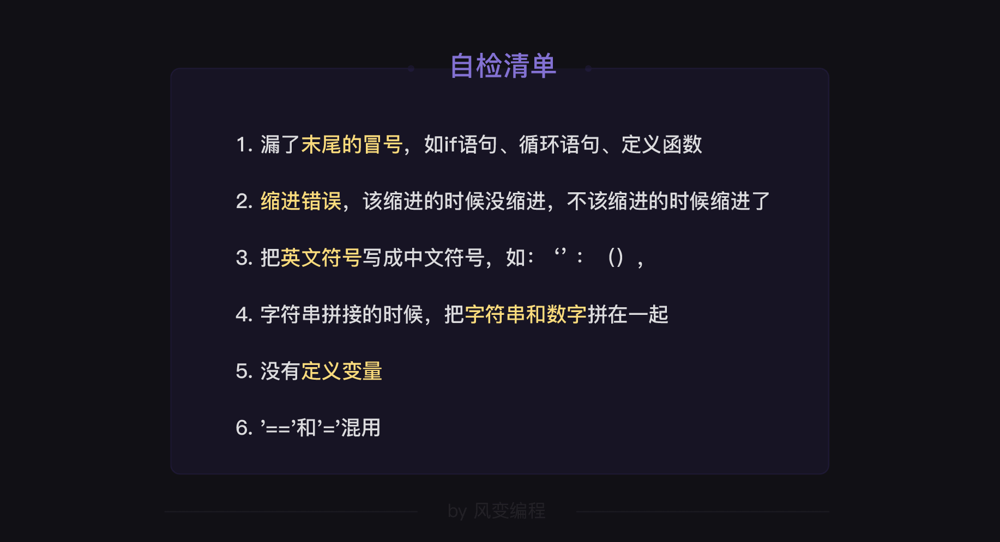

> ## Python 用法查询笔记

## 目标一：别叫我萌新
> ### 第0关 `print()` 函数与变量 
`2019年12月11日` 千寻的名字
 
```python
# 输出字符串
print('hello world')
# 输出数字
print(123)
# 输出字符串和数字的拼接
print('hello world' + str(123))
```

> ### 第1关 数据类型与转换
`2019年12月12日` 萌新的进化
```python
print(str(3.8))  # 输出: '3.8'
print(int(3.8))  # 输出: 3
print(float(3.8))  # 输出: 3.8
# 报错案例
print(int('3.8'))  # 输出: ValueError：invalid literal for int() with base 10: '3.8'
```
> 拼接
```python
magic = '水仙花数'
action = '是'
unit = '个'
expression = '＝1x1x1+5x5x5+3x3x3'
number = 153
print(str(number) + expression + action + unit + magic)
# 输出: 153＝1x1x1+5x5x5+3x3x3是个水仙花数
```
> `print()` 的完整参数
```python
# print(*objects, sep = ' ', end = '\n', file = sys.stdout, flush = False)
# 可以看到第一个参数objects带了*号，为不定长参数——这也是为什么print()函数可以传递任意数量的参数。
# 其余四个为默认参数，我们可以通过修改默认值来改变参数
# 对比一下下列代码的输出结果。
print('金枪鱼', '三文鱼', '鲷鱼')  # 金枪鱼 三文鱼 鲷鱼
print('金枪鱼', '三文鱼', '鲷鱼', sep = '+')  # 金枪鱼+三文鱼+鲷鱼
# sep控制多个值之间的分隔符，默认是空格
print('金枪鱼', '三文鱼', '鲷鱼', sep = '+', end = '=?')
# end控制打印结果的结尾，默认是换行)  # 金枪鱼+三文鱼+鲷鱼=?
```

> ### 第2关 条件判断与条件嵌套
`2019年12月13日` 灭霸的选择

> ### 第3关 input()函数
`2019年12月14日` 霍格沃茨来信

## 目标二：做出我的第一个项目
> ### 第4关 列表和字典
`2019年12月15日` 收纳的艺术

> ### 第5关 for循环和while循环
`2019年12月16日` 消灭该死的重复(上)

> ### 第6关 布尔值和四种语句
`2019年12月17日` 消灭该死的重复(下)

- `if ... in ...:`的用法
```python
actor = ['黄轩', '染谷将太']
if '黄轩' in actor:
    print('{}存在于列表 {} 中'.format('黄轩',actor))
```
> ### 第7关 项目实操：PK小游戏（1）
`2019年12月18日` 小游戏大学问

## 目标三：“编程思维”初探
> ### 第8关 编程思维：如何解决问题
`2019年12月19日` 编程学习的两大瓶颈思维
> ### 第9关 函数
`2019年12月20日` 深夜食堂营业记
- 函数的定义
```python
# 函数名：1. 名字最好能体现函数的功能，一般用小写字母和单下划线、数字等组合
#      2. 不可与内置函数重名（内置函数不需要定义即可直接使用）
def math(x):
# 参数：根据函数功能，括号里可以有多个参数，也可以不带参数，命名规则与函数名相同
# 规范：括号是英文括号，后面的冒号不能丢
    y = x**2 + 5
# 函数体：函数的执行过程，体现函数功能的语句，要缩进，一般是四个空格
    return y
# return语句：后面可以接多种数据类型，如果函数不需要返回值的话，可以省略

# 提示：x ** y 表示 x的y次幂
def comput(x):
    y = x ** 2 + x
    return y
print(comput(8)) # 输出: 70
```
- 传参和默认值
```python
def menu(appetizer, course, dessert = '绿豆沙'):
    print('一份开胃菜：' + appetizer)
    print('一份主食：' + course)
    print('一份甜品：' + dessert)
menu('话梅花生','牛肉拉面')
menu('话梅花生','牛肉拉面','银耳羹')
#银耳羹对应参数dessert
# 结果:
# 一份开胃菜：话梅花生
# 一份主食：牛肉拉面
# 一份甜品：绿豆沙
# 一份开胃菜：话梅花生
# 一份主食：牛肉拉面
# 一份甜品：银耳羹
```
- `random`和`time`工具库
```python
import time
import random
time.sleep(1)  # 停顿一秒 
random.choice([1,'2',3,'四','五']) # 随机输出: 3
```
- 函数返回多个值
```python
import random 
appetizer = ['话梅花生','拍黄瓜','凉拌三丝']
def coupon(money):
    if money < 5:
        a = random.choice(appetizer)
        return a
    elif 5 < money < 10:
        b = random.choice (appetizer)
        return b, '溏心蛋'
result = coupon(6)
print(result)  # 输出随机结果: ('话梅花生', '溏心蛋')
print(type(result))  # 输出: <class 'tuple'>
# result是一个元组
print(result[0])  # 输出随机结果: '话梅花生'
print(result[1])  # 输出: '溏心蛋'
```
- 变量作用域
```python
quantity = 0
def egg():    
    global quantity  # 告诉Python 我希望使用全局的这个变量
    quantity = 108
egg()
print(quantity)  # 输出: 108 
```
- 函数的嵌套 

    与其他语言无异
> ### 第10关 项目实操：PK小游戏（2）
`2019年12月21日` 工作量计算器


- 数字取整的相关操作
```python
import math
import random

print(math.ceil(1.2))  # 向上取整: 2
print(math.floor(1.2))  # 向下取整: 1
print(int(1.2))  # 向下取整: 1
print(round(1.2))  # 四舍五入: 1
# 分别取
print(math.modf(4.25))  # (0.25, 4.0)
print(math.modf(4.33))  # (0.33000000000000007, 4.0)
# 最后一个应该是0.33，但是浮点数在计算机中是无法精确的表示小数的，python采用IEEE 754规范来存储浮点数。
print(random.randint(10, 11))  # 范围内随机整数 a:开始范围,b:结束范围 开始值可结束值都包括在随机范围内
```
- `index()`函数

    index() 函数用于找出列表中某个元素第一次出现的索引位置。
语法为：list.index(obj)，obj为object（对象）的缩写。
具体可参考右侧的代码和运行结果。
```python
num = [0,1,0,1,2]
print(num.index(1))  # 数字1首先出现的索引位置是list[1]（索引位置从0开始）。
print(num.index(2))  # 数字2首先出现的索引位置是list[4]。
```
> ### 第11关 编程思维：如何debug
`2019年12月22日` 杀死那只“机”生虫！

多行注释有两种快捷操作：1、在需要注释的多行代码块前后加一组三引号''' 2、选中代码后使用快捷键操作：Windows快捷键是ctrl+/，Mac为cmd+/，适用于本地编辑器
```python
# 单行注释
'''
这是
多行
注释
'''
```
为了不让一些无关痛痒的小错影响程序的后续执行，Python给我们提供了一种异常处理的机制，可以在异常出现时即时捕获，然后内部消化掉，让程序继续运行。

这就是`try…except…`语句，具体用法如下：
```python
try:
    pass
    # 尝试执行
    # ....
    # ....
    # 代码要缩进
except:
    pass
    # 除非发生 报错,***是报错类型;一旦报错就执行下列代码
    # ....
    # ....
    # 报错后执行的代码,要缩进
```
报错类型的处理
```python
num = [1, 2, 0, 3]
for x in num:
    try:
        # 尝试执行下列代码
        print(6 / x)
    # 使用6除以num中的元素，并打印
    except ZeroDivisionError:
        # 除非发生ZeroDivisionError报错，执行下列代码：
        print('0是不能做除数的！')  # 打印“0是不能做除数的！”
    # 方式2：将两个（或多个）异常放在一起，只要触发其中一个，就执行所包含的代码。
    except(ZeroDivisionError, ValueError):
        print('你的输入有误，请重新输入！')
    
    # 方式3：常规错误的基类，假设不想提供很精细的提示，可以用这个语句响应常规错误。
    except Exception:
        print('你的输入有误，请重新输入！')
```
一个除法计算器的案例
```python
# 贴心的除法计算器
print('\n欢迎使用除法计算器！\n')

while True:
    try:
        x = input('请你输入被除数：')
        y = input('请你输入除数：')
        z = float(x) / float(y)
        print(x, '/', y, '=', z)
        break  # 默认每次只计算一次，所以在这里写了 break。
    except ZeroDivisionError:  # 当除数为0时，跳出提示，重新输入。
        print('0是不能做除数的！')
    except ValueError:  # 当除数或被除数中有一个无法转换成浮点数时，跳出提示，重新输入。
        print('除数和被除数都应该是整值或浮点数！')
    
    # 方式2：将两个（或多个）异常放在一起，只要触发其中一个，就执行所包含的代码。
    except(ZeroDivisionError, ValueError):
        print('你的输入有误，请重新输入！')
    
    # 方式3：常规错误的基类，假设不想提供很精细的提示，可以用这个语句响应常规错误。
    except Exception:
        print('你的输入有误，请重新输入！')

```
最后，关于Python的所有报错类型，有需要的话可以在这里查阅：https://www.runoob.com/python/python-exceptions.html
- 针对粗心造成的bug，有一份自检清单帮助大家检查。


0. 针对知识点不熟造成的bug，要记得多复习，查阅笔记，针对性地做练习掌握用法。
0. 针对思维不清的bug，要多用print()函数和#注释一步步地排查错误。
0. 针对容易被忽略的例外情况从而被动掉坑的bug，可以用try...except语句让程序顺利运行。

## 目标四：学会“找对象”
> ### 第12关 类与对象1
`2019年12月23日` 我们都是中国人

创建一个类
```python
# 下面，请你现学现用，创建一个“中国人”的类，并为其创建一个属性和一个方法。
# 属性:眼睛是黑色的
# 方法:打印出'吃饭，选择用筷子。'
class Chinese:
    eye = 'black'
    
    def eat(self):
        print('吃饭，选择用筷子。')


wufeng = Chinese()  # 类的实例化
print(type(wufeng))
print(wufeng)
print(wufeng.eye)  # 实例调用类属性
wufeng.eat()  # 调用类中的方法（传参不用管self）
'''
输出:
<class '__main__.Chinese'>
<__main__.Chinese object at 0x0000018B53FA2D88>
black
吃饭，选择用筷子。
'''
```
- 创建类的两个关键点
    - 特殊参数：self
    
    第一点：只要在类中用def创建方法时，就必须把第一个参数位置留给 self，并在调用方法时忽略它（不用给self传参）。

    第二点：当在类的方法内部想调用类属性或其他方法时，就要采用self.属性名或self.方法名的格式。
    - 特殊方法：初始化方法
```python
class Chinese:  # 类的创建
    eye = 'black'  # 类属性的创建
    
    def __init__(self, hometown):  # 类的初始化函数
        self.hometown = hometown  # 实例属性的创建
        print('程序持续更新中...')  # 初始化中的语句
    
    def born(self):  # 实例方法的创建
        print('我生在%s;' % (self.hometown))


wufeng = Chinese('广东')  # 类的实例化
print(wufeng.eye)  # 打印实例属性,输出: black
wufeng.born()  # 实例方法的调用,输出: 我生在广东;
```
- 面向对象编程
    
    向过程编程：首先分析出解决问题所需要的步骤（即“第一步做什么，第二步做什么，第三步做什么”），然后用函数实现各个步骤，再依次调用。
> ### 第13关 类与对象2
`2019年12月24日` 中国人和广东人
```python
# 你可以继续拓展上面的例子，或往上（地球人），或往下（深圳人）。跑个代码体验一下：
# 先阅读代码和注释，然后直接运行代码。
class Earthman:
    eye_number = 2

# 中国人继承了地球人
class Chinese(Earthman):
    eye_color = 'black'

# 广东人继承了中国人，同时也继承了地球人。
class Cantonese(Chinese):
    pass

yewen = Cantonese()
print(yewen.eye_number)  # 输出: 2
print(yewen.eye_color)  # 输出: black
```
- 类的多重继承

    越靠近子类（即越靠左）的父类，越亲近，越优先考虑。子类调用属性和方法时，会先在靠左的父类里找，找不到才往右找。
```python
class C0:
    name = 'C0'

class C1:
    num = 1

class C2(C0):
    num = 2

class C3:
    name = 'C3'

class C4(C1, C2, C3):
    pass

ins = C4()
print(ins.name)  # 打印出 C0
print(ins.num)  # 打印出 1
```
- 类的定制,新增代码
```python
class Chinese:
    eye = 'black'
    
    def eat(self):
        print('吃饭，选择用筷子。')

class Cantonese(Chinese):  # 类的继承
    native_place = 'guangdong'  # 类的定制
    
    def dialect(self):  # 类的定制
        print('我们会讲广东话。')

yewen = Cantonese()
print(yewen.eye)    # 输出: black
# 父类的属性能用
print(yewen.native_place)    # 输出: guangdong
# 子类的定制属性也能用
yewen.eat()    # 输出: 吃饭，选择用筷子。
# 父类的方法能用
yewen.dialect()    # 输出: 我们会讲广东话。
# 子类的定制方法也能用

# 我们可以在子类下新建属性或方法，让子类可以用上父类所没有的属性或方法。这种操作，属于定制中的一种：新增代码。
```
- 类的定制,重写代码
```python
class Chinese:
    def land_area(self, area):
        print('我们居住的地方，陆地面积是%d万平方公里左右。' % area)

class Cantonese(Chinese):
    def land_area(self, area=960, rate=0.0188):  # 间接的对方法进行重写
        Chinese.land_area(self, area * rate)  # 直接继承父类方法,再调整参数

yewen = Cantonese()
yewen.land_area()   # 输出: 我们居住的地方，陆地面积是18万平方公里左右。
# 两个参数都有默认值，所以可以这么调用。
```

> ### 第14关 项目实操：PK小游戏（3）
`2019年12月25日` 流浪图书的旅途
- 更符合编程习惯的方法`__str__(self)` `__str__`打印对象即可打印出该方法中的返回值，而无须再调用方法。

    在Python中，如果方法名形式是左右带双下划线的，那么就属于特殊方法（如初始化方法），有着特殊的功能。

    解释一下：只要在类中定义了__str__(self)方法，那么当使用print打印实例对象的时候，就会直接打印出在这个方法中return的数据。

    可能有点绕，看代码会直观一点。我们直接把上述代码里的方法名show_info(self)替换成__str__(self)，留意最后一行调用的代码，然后点击运行：
```python
class Book:

    def __init__(self, name, author, comment, state = 0):
        self.name = name
        self.author = author
        self.comment = comment
        self.state = state

    def __str__(self): # 打印对象时的默认输出方法
        if self.state == 0:
            status = '未借出'
        else:
            status = '已借出'
        return '名称：《%s》 作者：%s 推荐语：%s\n状态：%s ' % (self.name, self.author, self.comment, status)

book1 = Book('像自由一样美丽','林达','你要用光明来定义黑暗，用黑暗来定义光明')
# 传入参数，创建实例对象
print(book1)
# 直接打印对象即可，不能写成print(book1.__str__())

"""
输出:
名称：《像自由一样美丽》 作者：林达 推荐语：你要用光明来定义黑暗，用黑暗来定义光明
状态：未借出
"""
```
## 目标五：用Python给朋友发个邮件
> ### 第15关 编码和文件读写
`2019年12月26日` 计算机的"新华字典"

> 编码
- 二进制

```
00000000 表示状态0: 烽火全暗，一个敌人没有，平安无事，放心睡觉。
11111111 表示状态255：烽火全亮，来了255个敌人。起来打啊！
```
bit和byte长得有点像，可别混淆！1 byte = 8 bit，也就是1字节等于8比特。

而我们常看到的下载速度KB却是以字节每秒为单位显示的，1byte = 8bit，所以运营商说的带宽得先除以8，你的百兆宽带下载速度，也就是十几兆了。

- 编码表

`encode()和decode()`

```python
print('吴枫'.encode('utf-8'))  # b'\xe5\x90\xb4\xe6\x9e\xab'
print('吴枫'.encode('gbk'))  # b'\xce\xe2\xb7\xe3'
print(b'\xe5\x90\xb4\xe6\x9e\xab'.decode('utf-8'))  # 吴枫
print(b'\xce\xe2\xb7\xe3'.decode('gbk'))  # 吴枫
print(type('吴枫'))  # <class 'str'>
print(type(b'\xce\xe2\xb7\xe3'))  #  <class 'bytes'>
```
 
常见的编码方式有: `ASCII`,`UTF-8`,`GBK`,`base64`

图片的编码方式是:`ISO-8859-1`吗?

`https://www.baidu.com/s?wd=%E5%90%B4%E6%9E%AB`
```
\xe5\x90\xb4\xe6\x9e\xab  # Python编码“吴枫”的结果
%E5%90%B4%E6%9E%AB # 网址里的“吴枫”
??? Python 中是用什么API来编码和解码地址栏的特殊字符
```
最后我们再来看下ASCII编码，它不支持中文，所以我们来转换一个大写英文字母K。
```python
print('K'.encode('ASCII'))  # b'K'
```
> 文件读写 
- 读取文件

别忘了\在Python中是转义字符，所以时常会有冲突。为了避坑，Windows的绝对路径通常要稍作处理，写成以下两种格式；

【第1步-开】打开文件，使用的是`open(file,mode,encoding)`函数。
```python
open('C:\\Users\\Ted\\Desktop\\test\\abc.txt')
#将'\'替换成'\\'

open(r'C:\Users\Ted\Desktop\test\abc.txt')
#在路径前加上字母r
```

【第2步-读】 `file.read()` 方法

```python
file1 = open('/Users/Ted/Desktop/test/abc.txt','r',encoding='utf-8') 
filecontent = file1.read()   
print(filecontent)
```

【第3步-关】关闭文件，使用的是`close()`函数。
```python
# 打开文件
file1 = open(file='/Users/Ted/Desktop/test/abc.txt', mode='r', encoding='utf-8')
# 读文件
filecontent = file1.read()
# 显示内容
print(filecontent)
# 关闭文件
file1.close()
      
```

- 写入文件

是这样子的，'w'写入模式会给你暴力清空掉文件，然后再给你写入。如果你只想增加东西，而不想完全覆盖掉原文件的话，就要使用'a'模式，表示append，你学过，它是追加的意思。
```python
file1 = open('/Users/Ted/Desktop/test/abc.txt', 'a',encoding='utf-8') 
#以追加的方式打开文件abc.txt
file1.write('张无忌\n')     
#把字符串'张无忌'写入文件file1
file1.write('宋青书\n')     
#把字符串'宋青书'写入文件file1
file1.close()            
```

有两个小提示：1.write()函数写入文本文件的也是字符串类型。2.在'w'和'a'模式下，如果你打开的文件不存在，那么open()函数会自动帮你创建一个

为了避免打开文件后忘记关闭，占用资源或当不能确定关闭文件的恰当时机的时候，我们可以用到关键字with，之前的例子可以写成这样：
```python
# 普通写法
file1 = open('abc.txt','a') 
file1.write('张无忌') 
file1.close()

# 使用with关键字的写法
with open('abc.txt','a') as file1:
#with open('文件地址','读写模式') as 变量名:
    #格式：冒号不能丢
    file1.write('张无忌') 
    #格式：对文件的操作要缩进
    #格式：无需用close()关闭
```
- 小练习

现在我们要把这里每一行的名字、分数也分开，这时需要我们使用`split()`来把字符串分开，它会按空格把字符串里面的内容分开。
```python
file1 = open('/Users/Ted/Desktop/scores.txt','r',encoding='utf-8') 
file_lines = file1.readlines()
file1.close()

for i in file_lines:   #用for...in...把每一行的数据遍历  
    data =i.split()    #把字符串切分成更细的一个个的字符串
    print(data)        #打印出来看看
```

`split()`是把字符串分割的，而还有一个`join()`函数，是把字符串合并的。

```python
a=['c','a','t']
b=''
print(b.join(a))  # cat
c='-'
print(c.join(a))  # c-a-t
```
`join()`的用法是`str.join(sequence)`，`str`代表在这些字符串之中，你要用什么字符串连接，在这里两个例子，一个是空字符串，一个是横杠，`sequence`代表数据序列，在这里是列表a。


> ### 第16关 模块
`2019年12月27日` 哆啦A梦的百宝箱

> ### 第17关 项目实操：收发邮件
`2019年12月28日` 邮件还能这么发

## 目标六：完成一个迷你产品
> ### 第18关 编程思维：产品思维
`2019年12月29日` 需求你造吗?我造

> ### 第19关 项目实操：毕业项目
`2019年12月30日` 高效偷懒的正确方式


