## 7 进阶练习 做个测单词的小工具

> 第一步：分析需求，明确目标

扇贝网：https://www.shanbay.com/已经有一个测单词量的功能，
我们要做的就是把这个功能复制下来，并且做点改良，搞一个网页版没有的功能 ———— 自动生成错词本。

在这一步，请阅读文档的同时打开浏览器的扇贝网，跟着我一步步来。

- 步骤讲解

这里是扇贝网的测单词量的界面：
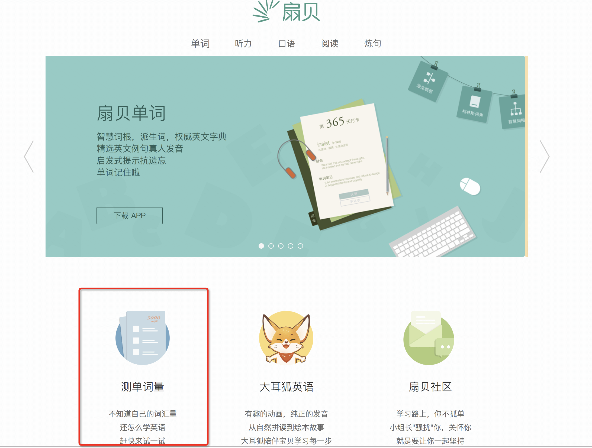

想要复制功能，就先做分析，这个网页是怎样的工作流程。

所以，先体验全程，大概分为如下五个页面：
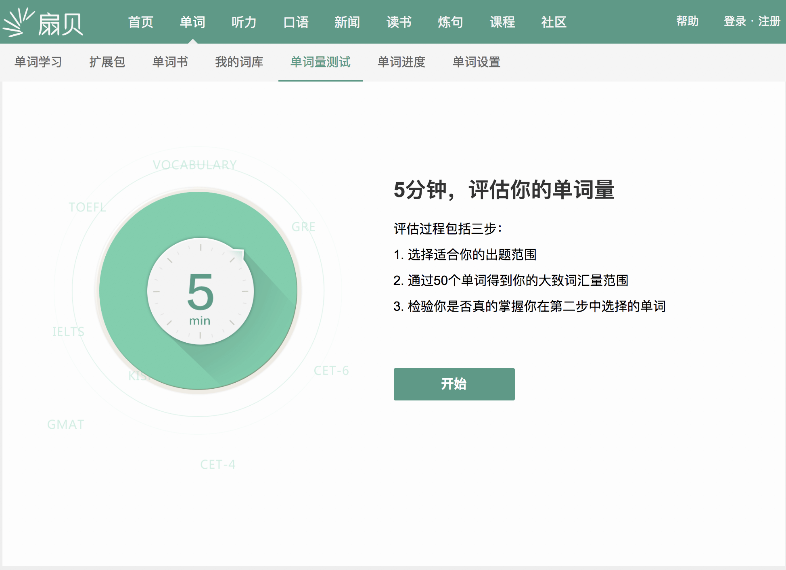

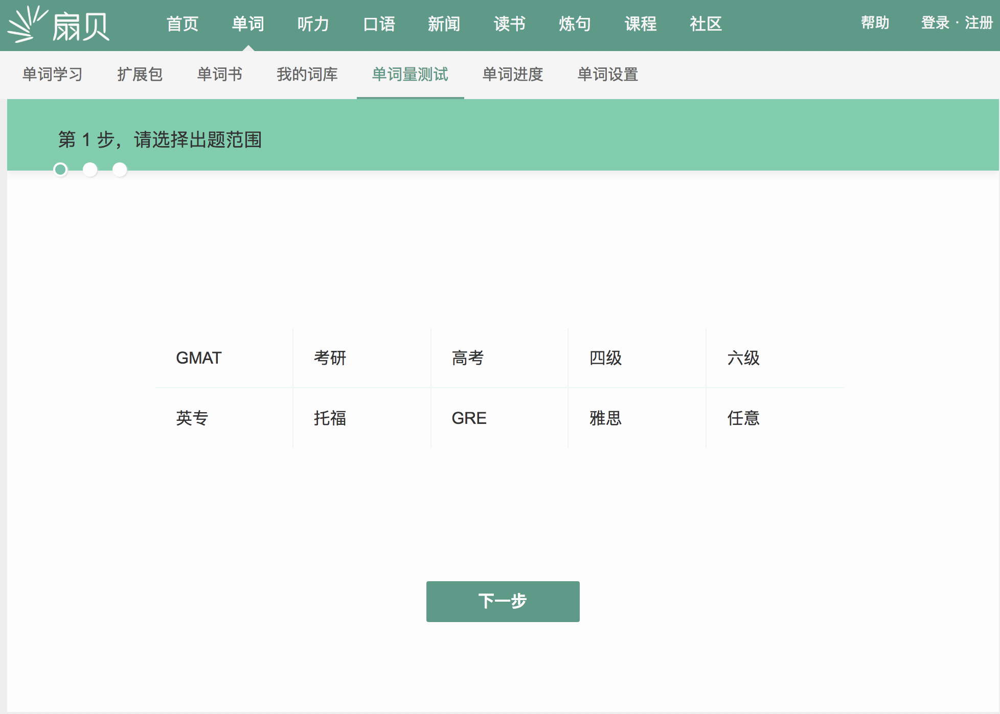

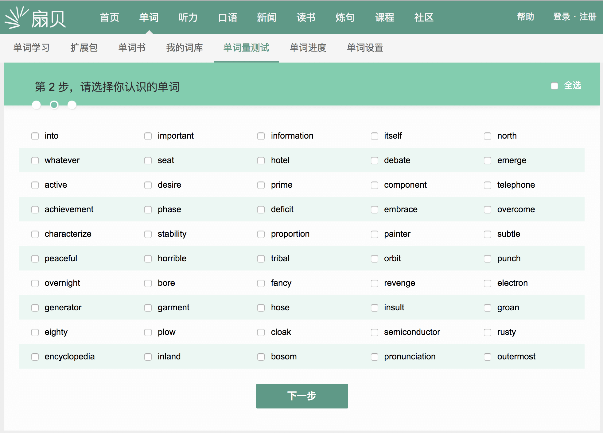

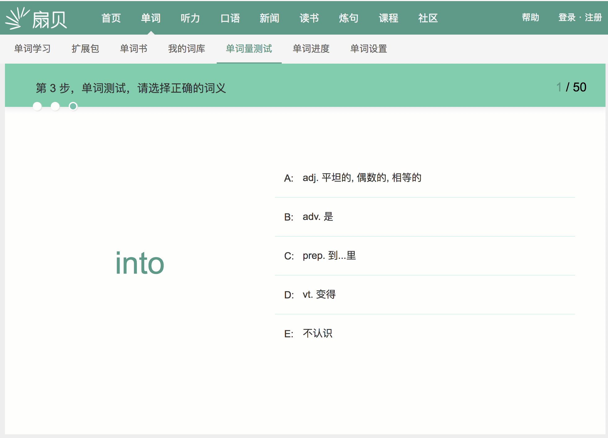

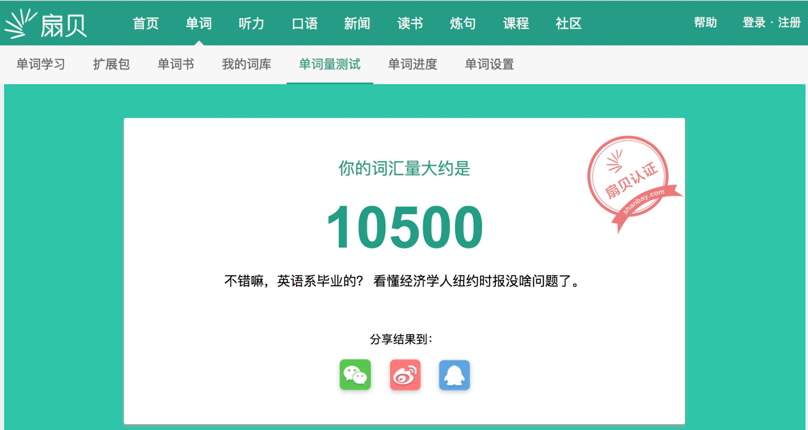

先看源代码里是否有我们的单词。倘若有，就用find()/find_all()定位提取需要的数据；
没有的话，就要调用【检查】-【Network】 - 【XHR】 - 找数据。

在Headers里看网址，在Preview里看内容。

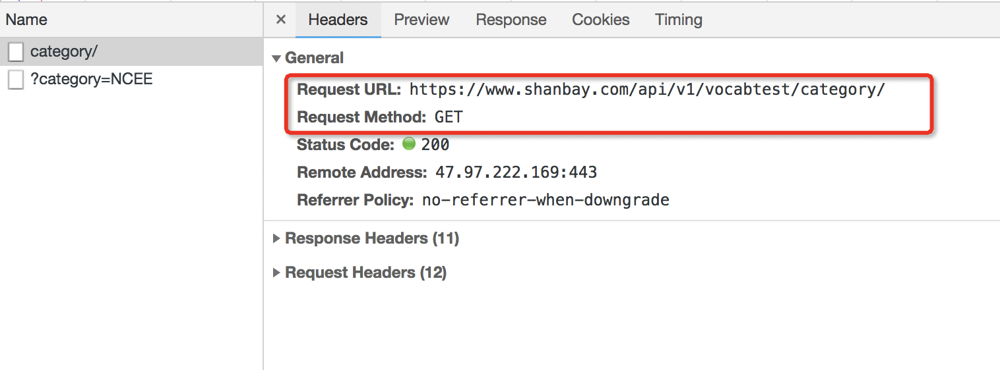

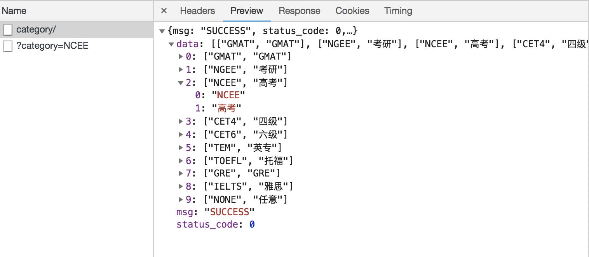

如图：category/这一个XHR，用的是Get请求方式，访问了网址https://www.shanbay.com/api/v1/vocabtest/category/，下载了一个字典。

其中“data”里面，藏了十个元素。这十个元素，里面对应的内容，就是我们最开始要选择的“词汇范围”。

十个元素，每个里面都有两个内容。0是什么暂时还不知道，先放着。1是我们词汇范围没错。比如我们选择高考，那么在第2个元素里就有一个0是“NCEE”，有一个1是“高考”。

我们接着看下一个XHR：

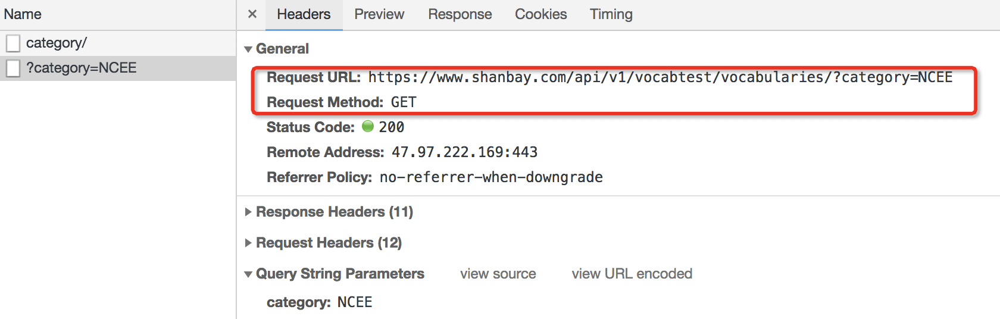

这个图片说明：?category=NCEE 这一个XHR，访问了网址https://www.shanbay.com/api/v1/vocabtest/vocabularies/?category=NCEE

在此，“NCEE”出现了两次：这个XHR的名字里面有“NCEE”，它访问的网址里面也有“NCEE”。

这就揭示了一种对应关系：当我们选择“高考”词库，那么下一个XHR，访问的网址就会是用“NCEE”来结尾。

可以多试几个词库验证下我们的猜测，的确里面的对应关系是一致的。考研和NGEE一组，四级和CET4一组，六级和CET6一组。

第1个XHR，所访问的网址规律就是：'https://www.shanbay.com/api/v1/vocabtest/vocabularies/?category='+'你选择的词库，对应的代码'。

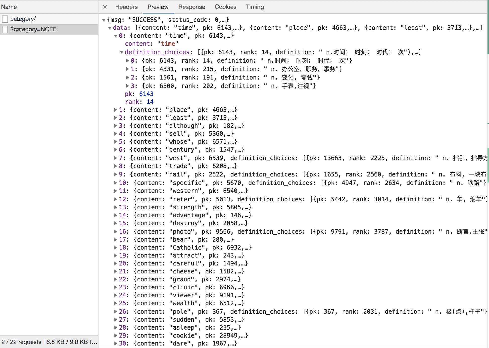

如图，它下载到的是一个字典。字典里，包含了用来测试词汇量的50个单词。

第0，它先给出单词。

第1，它给出四个不同的翻译，每个翻译都有一个对应的pk值和rank值。

第2，它再给出一组pk值和rank值。它们，和正确翻译里面的pk值与rank值一致。

那么，我们就可以理清楚，这个网页的工作逻辑。如下图：
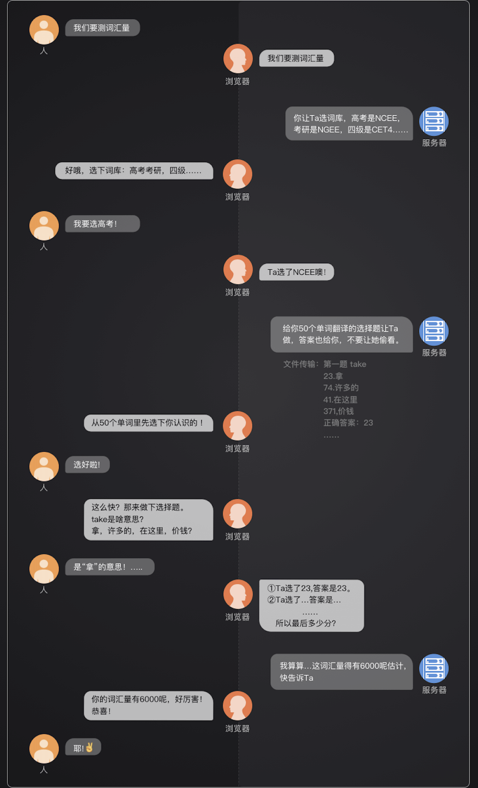

到这里，我们就完成了至关重要的“需求分析”这个步骤。
