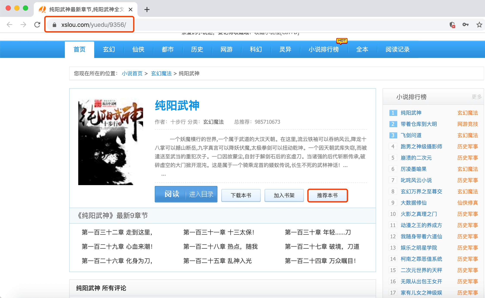

## 步骤讲解
>### 体验流程
想要对热榜的小说进行推荐，我们首先需要用浏览器体验这个过程。

1. 前往小说楼，手动找到**热榜**所在位置
2. 随机对一部小说进行推荐
3. 最后，再用Python代码去模拟这个过程
>### 进入热榜
首先，打开小说楼的排行榜页：https://www.xslou.com/top/allvisit_1/

打开【检查】工具，选择【Network】，勾选【Preserve log】（因为等会可能会有页面跳转，勾选上防止在跳转过程中请求被清空）。

>### 体验登录
1. 然后我们可以随机点击其中一本小说，对其进行推荐

2. 此时，如果没有登录小说楼（或注册）的用户，会自动跳到小说楼的**登录页**面：https://www.xslou.com/login.php
也就是说，想要推荐，我们必须通过登录呀~


3. 阅读该URL，很容易能够看出这个是一个**登录页**，因为有链接有个`login`（中文：登录）

4. 输入账号和密码，同时查看Network，发现浏览器会携带着账号和密码发起Post请求。


>### 获取推荐链接
1. 完成登录之后，再进行推荐会跳转新页面，提示推荐成功

通过翻找Network，我们定位到，推荐的请求是就是当前的url：https://www.xslou.com/modules/article/uservote.php?id=xxx

该请求只需要一个参数：id（书籍的id）

注意：该链接限制了每天推荐不能超过5次，也就是说该链接的请求不能超过5次

>### 获取书籍id
1. 进入小说热门列表页面：https://www.xslou.com/top/allvisit_1/右键`检查`，
发现该页面的数据就在第0个请求当中。

2. 模拟推荐书籍《纯阳武神》时，拿到的id是`9356`，
不过这个id到底从哪里来的？
要么，它藏在了HTML网页当中；
要么，它就是在请求的时候，后台下发的。
可先在`Elements`搜索一下该`id`，看它在不在`HTML`里。
（【搜索快捷键】win:ctrl+f | mac:command+f）

3. 经过分析，发现id确实藏在了HTML页面的链接当中：https://www.xslou.com/yuedu/9356/

4. 下一步就是将数字`9356`从链接中分离出来，方法有很多，老师这里只讲解过滤器fliter过滤数字
```python
link = 'https://www.xslou.com/yuedu/9356/'

# 字符串link过滤出数字id（9356）
id_list = list(filter(str.isdigit,link))
book_id = ''.join(id_list)

# 步骤解析：1、filter()过滤数字 2、filter对象转列表 3、列表转字符串 
# filter(str.isdigit,字符串) 
# 第一个参数用来判断字符串的单个元素是否是数字，数字保留
# filter()返回的是对象，需要用list()函数转换成列表
# ''.join(列表)将列表转换成字符串
```
思考实现方案
所以正确的流程应该是：

模拟登录获取cookies
拿到书籍的id
使用id参数和cookies请求推荐
`注`：其中，前两步可以顺序调换。