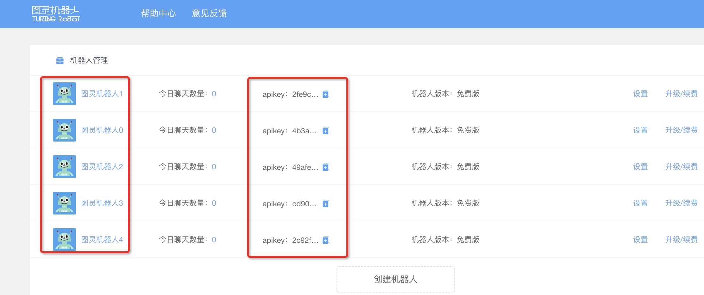

> ### 练习介绍
学了爬虫这么久，想不想接触下AI，创建一个可以聊天的机器人呀٩̋(๑˃́ꇴ˂̀๑)

要求：
实现功能：利用图灵机器人官网http://www.tuling123.com/的接口，创建一个可以聊天的机器人

> ### 步骤讲解
进入图灵机器人官网http://www.tuling123.com/，戳进帮助中心。
就像打开玩具先看说明书一样，我们来看看官方文档怎么说怎么用～

在功能说明中，我们知道，首先得登录注册，用免费版本就可以了（当然～土豪请随意），创建机器人

在“机器人设置”中，我们用的是第一个API接入

那什么是API呢？通俗地讲：
API就是接口，就是通道，负责一个程序和其他软件的沟通，本质是预先定义的函数，而我们不需要了解这个函数只是调用这个接口就可达到函数的效果。

好，接下来我们看下“API V2.0接入文档”.

接口说明：API接口可调用聊天对话、语料库、技能三大模块的语料。
很好，我们今天想做的聊天机器人用这个接口就刚巧合适～

同时，在使用说明中我们可以知晓：
首先创建post请求所需的json数据，然后向指定的接口发起post请求即可，
而且从参数说明中可以看到，只有参数 perception 和 userinfo 才是必须的.

对于userid这个参数官方文档说的是：长度小于32，是用户的唯一标识，这里我们只要创建userid 是长度小于32的字符串即可

说明书已经看完啦，来，开始着手做准备工作！

那我们回到主页，注册登录

然后在机器人管理界面，创建图灵机器人，最多可以创建5个，由此得出对应的5个apikey。(实际上一个就够啦)
apikey是针对接口访问的授权方式。

准备工作做完啦，接下来想想该如何写代码

