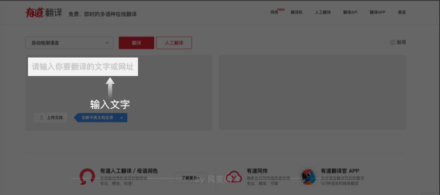
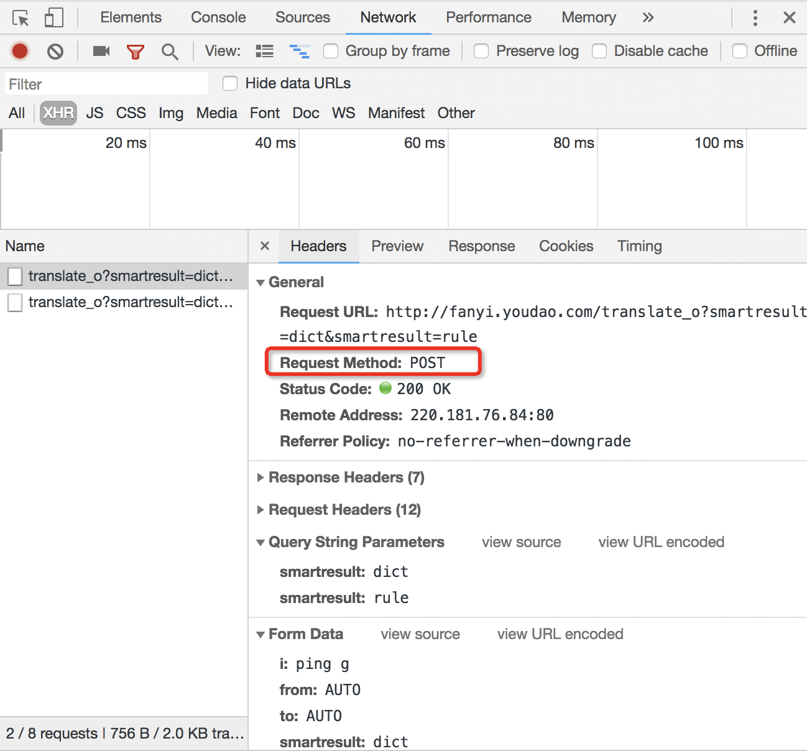

### 第一步：分析问题，明确目标

实现功能：用户输入英文或中文，程序即可打印出来对应的译文。

> 步骤讲解

这个页面，我们在左边输入文字，那么浏览器会把输入的信息传输给服务器，再返回对应的内容。

我们希望达成的效果如下图，即用户输入英文或中文，程序即可打印出来对应的译文：

### 第二步: 思考要用到的知识
> 步骤讲解

实现一键翻译的功能，最简单的方案便是爬虫。在此，我们选择的网站是有道翻译。http://fanyi.youdao.com/

这个页面，你在左边输入文字，那么浏览器会把你输入的信息传输给服务器。再返回对应的内容。
这就是一个典型的Post操作。

我们在Headers也可以看到“Request Method: POST”哦

在前几关练习我们用的都是Get方式请求，Post是另一种常见的方式，课上已经学过其用法，在此不多赘述。
**Get是向服务器发索取数据的一种请求，而Post是向服务器提交数据的一种请求**

虽然第八关我们主要讲的是Cookies，
**Cookies用于服务器实现会话，用户登录及相关功能时进行状态管理**
但这道题并不需要用到小饼干，因为不需要登录不需要账号密码等。
主要考查的还是Post的用法。

**注意哦 ლ(╹◡╹ლ)**
有道翻译有反爬虫机制，它使用了加密技术。如果你的程序报错，你可以通过搜索、查阅资料找到解决方案：尝试把访问的网址中“/translate_o”中的“_o”删除。
服务器返回的内容，是json的格式。我们可以用处理列表、处理字典的手段来提取翻译。

### 第三步：写代码

你可以在浏览器的`[network]-[Headers]-[General]`里找到需要访问的网址，在`[network]-[Headers]-[From data]`里找到需要上传的数据。

如果没思路，可以偷偷看下提示哦～
