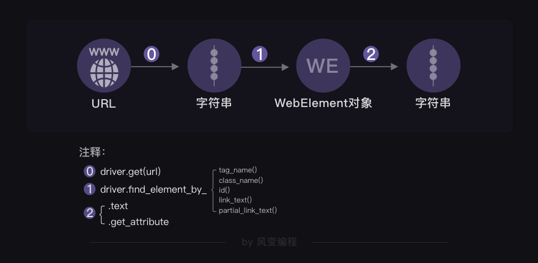
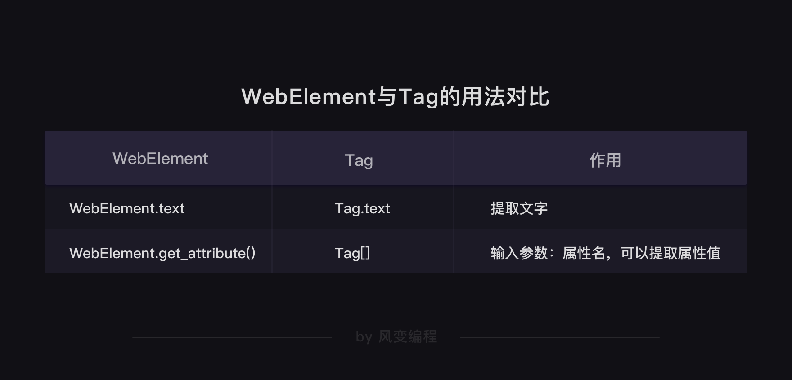
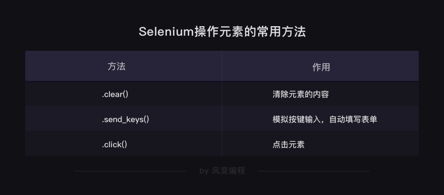

## Selenium 只会浏览器自动工作

> 1.Selenium 是什么

`selenium`是什么呢？它是一个强大的Python库。

它可以做什么呢？它可以用几行代码，控制浏览器，做出自动打开、输入、点击等操作，就像是有一个真正的用户在操作一样。

> 2.怎么用

首先，和其它所有Python库一样，`selenium`需要安装，方法也很简单， 使用`pip`安装。
```shell script
pip install selenium # Windows电脑安装selenium
pip3 install selenium # Mac电脑安装selenium
```

- 设浏览器引擎
```python
# 本地Chrome浏览器设置方法
from selenium import webdriver  # 从selenium库中调用webdriver模块
import time  # 调用time模块

driver = webdriver.Chrome()  # 设置引擎为Chrome，真实地打开一个Chrome浏览器
```
- 获取数据
```python
driver.get("url")
driver.find_element_by_class_name("className")
```

- 解析与提取数据
```python
# HTML源代码字符串 = driver.page_source 
```

- 自动操作浏览器


> 3.实操运用
- 确认目标
- 分析过程
- 代码实现
> 4.本关总结