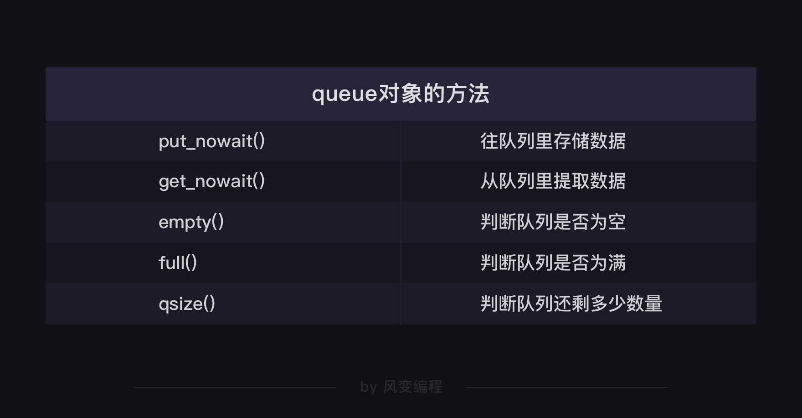

练习介绍  
要求：  
请使用多协程和队列，爬取时光网电视剧TOP100的数据（剧名、导演、主演和简介），并用csv模块将数据存储下来。

时光网TOP100链接：http://www.mtime.com/top/tv/top100/

目的：
1. 练习掌握gevent的用法
2. 练习掌握queue的用法

### 使用gevent库的重点

### 使用queue模块的重点

### queue对象的方法

### csv写入步骤

