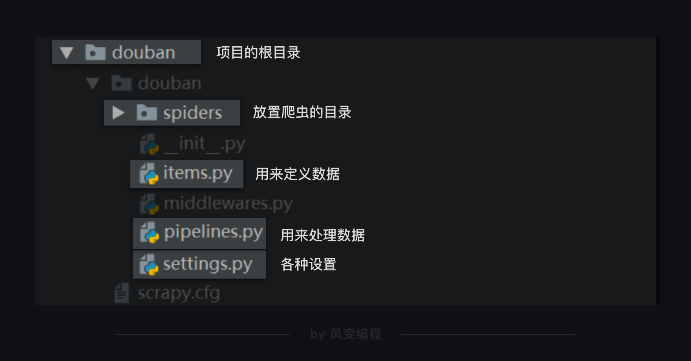
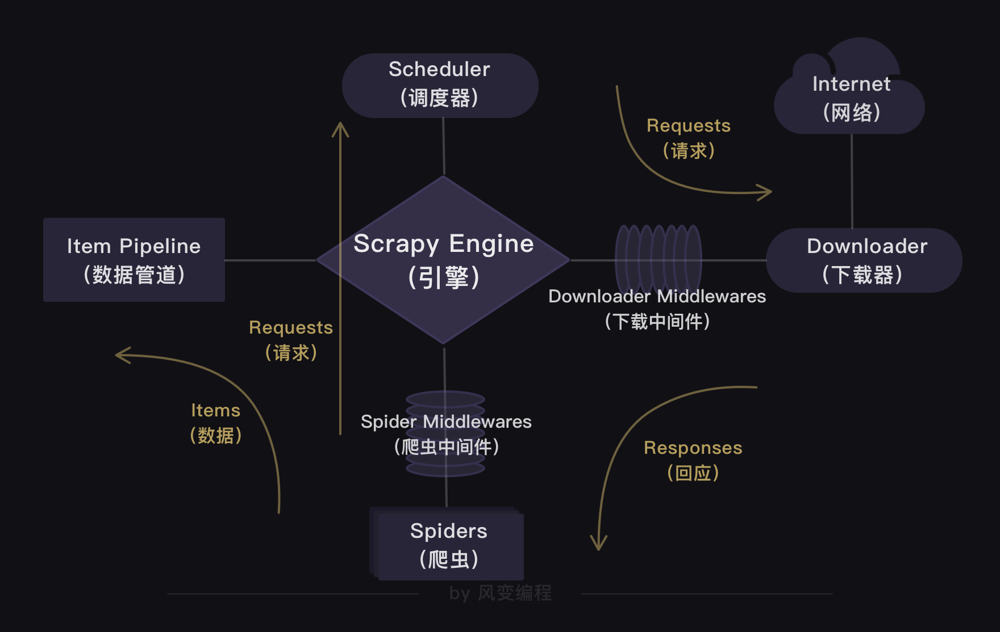
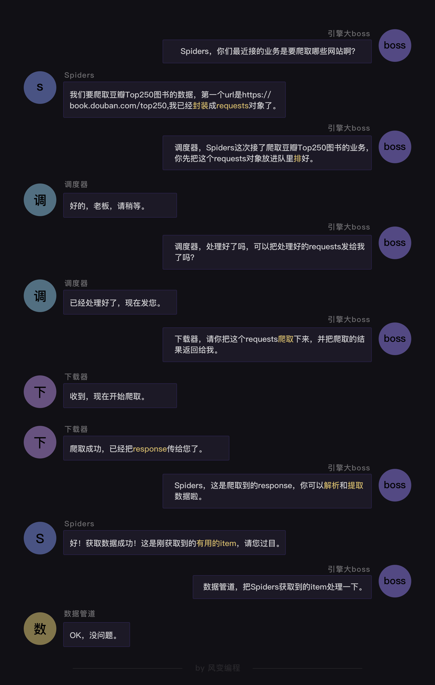
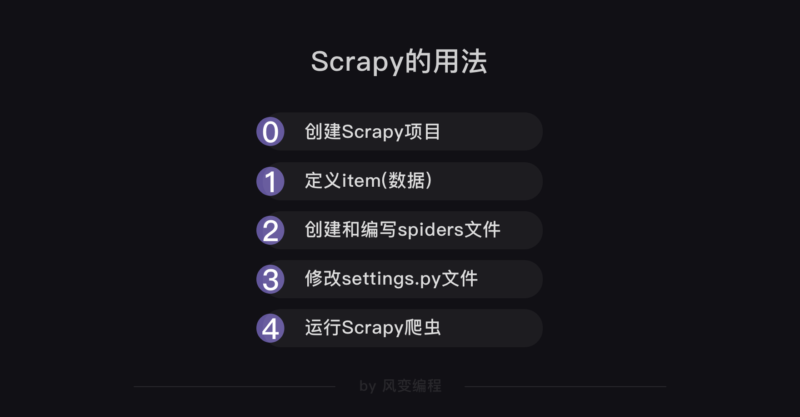

## 各司其职的爬虫公司

### 1.scrapy是什么
- scrapy的结构
    - 我会以爬虫流程的顺序来依次跟你介绍Scrapy爬虫公司的4大部门。
    - `Scheduler`(调度器)部门主要负责处理引擎发送过来的requests对象（即网页请求的相关信息集合，包括params，data，cookies，request headers…等），会把请求的url以有序的方式排列成队，并等待引擎来提取（功能上类似于gevent库的queue模块）。
    - `Downloader`（下载器）部门则是负责处理引擎发送过来的requests，进行网页爬取，并将返回的response（爬取到的内容）交给引擎。它对应的是爬虫流程【获取数据】这一步。
    - `Spiders`(爬虫)部门是公司的核心业务部门，主要任务是创建requests对象和接受引擎发送过来的response（Downloader部门爬取到的内容），从中解析并提取出有用的数据。它对应的是爬虫流程【解析数据】和【提取数据】这两步。
    - `Item Pipeline`（数据管道）部门则是公司的数据部门，只负责存储和处理Spiders部门提取到的有用数据。这个对应的是爬虫流程【存储数据】这一步。
    - `Downloader Middlewares`（下载中间件）的工作相当于下载器部门的秘书，比如会提前对引擎大boss发送的诸多requests做出处理。
    - `Spider Middlewares`（爬虫中间件）的工作则相当于爬虫部门的秘书，比如会提前接收并处理引擎大boss发送来的response，过滤掉一些重复无用的东西。

- scrapy的工作原理

    - Scrapy中的程序全部都是异步模式，所有的请求或返回的响应都由引擎自动分配去处理。
    - 程序会做异常处理，跳过报错的请求，继续往下运行程序。

### 2.scrapy的用法
- 明确目标与分析
- 代码实现--创建项目

创建项目: `scrapy startproject 项目名`


- 代码实现--编辑爬虫

在Scrapy中，每个爬虫的代码结构基本都如下所示：
```python
import scrapy

class DoubanSpider(scrapy.Spider):
    name = 'douban'
    allowed_domains = ['book.douban.com']
    start_urls = ['https://book.douban.com/top250?start=0']
    
    def parse(self, response):
        print(response.text)
```
- 代码实现--定义数据

如何在items.py里定义这些数据。代码如下
```python
import scrapy
#导入scrapy
class DoubanItem(scrapy.Item):
#定义一个类DoubanItem，它继承自scrapy.Item
    title = scrapy.Field()
    #定义书名的数据属性
    publish = scrapy.Field()
    #定义出版信息的数据属性
    score = scrapy.Field()
    #定义评分的数据属性
```
它的数据类型是我们定义的DoubanItem，属于“自定义的Python字典”。

yield语句你可能还不太了解，这里你可以简单理解为：它有点类似return，不过它和return不同的点在于，它不会结束函数，且能多次返回信息。

- 代码实现--设置

    - 修改请求头 `USER_AGENT`
    - 修改robots协议 `ROBOTSTXT_OBEY=True`改成`ROBOTSTXT_OBEY=False`

- 代码实现--运行

项目目录下执行: `scrapy crawl 项目名`

### 3.复习
- Scrapy的结构

- Scrapy的工作原理

- Scrapy的用法

